<h1 align="center">基于SpringBoot的MES制造执行系统【带论文】</h1>

- <b>完整代码获取地址：从戎源码网 ([https://armycodes.com/](https://armycodes.com/))</b>
- <b>技术探讨、资料分享，请加QQ群：692619798</b>
- <b>作者微信：19941326836  QQ：952045282</b>
- <b>承接计算机毕业设计、Java毕业设计、Python毕业设计、深度学习、机器学习</b>
- <b>选题+开题报告+任务书+程序定制+安装调试+论文+答辩ppt 一条龙服务</b>
- <b>所有选题地址 ([https://github.com/Descartes007/allProject](https://github.com/Descartes007/allProject)) </b>

## 一、项目介绍

基于SpringBoot的MES制造执行系统，后台管理与前端控制台，系统角色主要为 系统管理员 / 车间员工。主要功能：
### 公共（所有角色）
- 基本操作：登录、登出、注册、修改密码、获取/修改个人信息、session 获取当前用户
- 文件管理：文件上传（保存至 static/upload）、文件下载
- 通用查询：下拉联动选项、按列取单条记录、单列求和、分组统计、按值/时间统计、提醒计数接口
- 报表与导出：支持前端导出与图表数据（供 ECharts 使用）
### 超级管理员
- 用户与权限：用户增删改查、重置密码、token 认证管理
- 基础档案管理：产品信息、物料信息、工艺线路、部门、客户、员工 等的 CRUD（列表/分页/详情/新增/修改/删除/查询）
- 业务管理：生产计划（下达/分页/详情/修改/删除/提醒/统计）、销售订单管理（CRUD/提醒/统计）
- 系统配置：站点/第三方（如百度 AIP）的配置管理
- 系统级统计与审计：提供聚合/分组/时间统计数据供仪表盘使用
### 车间员工（生产人员）
- 查看与操作：查看自己相关的生产计划与订单（后端通过 session/tableName/username 做过滤），提交/更新生产相关记录
- 业务交互：前端可调用公开接口（/list、/detail）快速获取数据，接收提醒与统计

## 二、项目技术

- 编程语言：Java（后端） + JavaScript（前端）
- 架构：B/S 架构（前端 SPA + 后端 REST API）
- 前端技术：Vue 2、vue-router、Vuex，Element-UI，Axios、vue-cli（构建）、svg-sprite-loader（图标），ECharts（图表）

## 三、运行环境

- JDK版本：1.8及以上都可以
- 操作系统：Windows7/10、MacOS
- 开发工具：IDEA、Ecplise、MyEclipse都可以

## 四、数据库配置文件

- npm版本：6.14.13及以上都可以
- Redis版本：3.2.100及以上都可以
- 文件名：application.yml
- 编码类型：utf8

## 论文截图

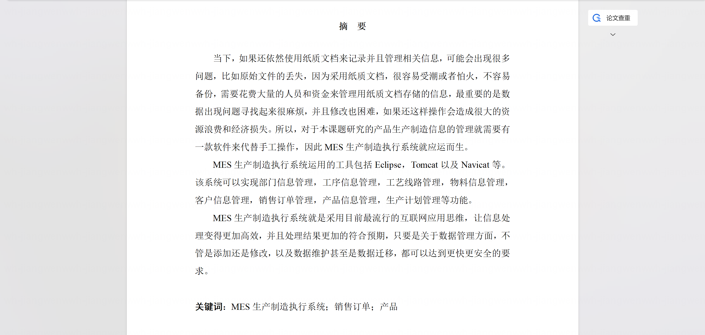

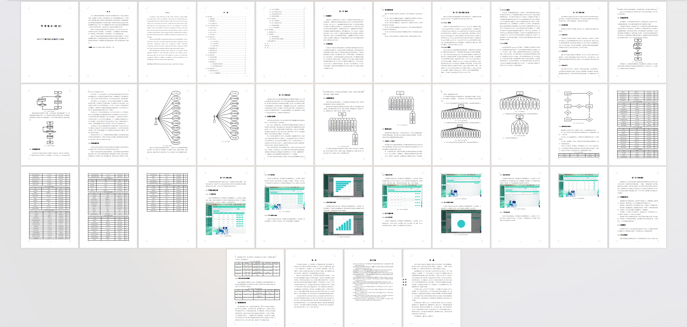

## 系统截图

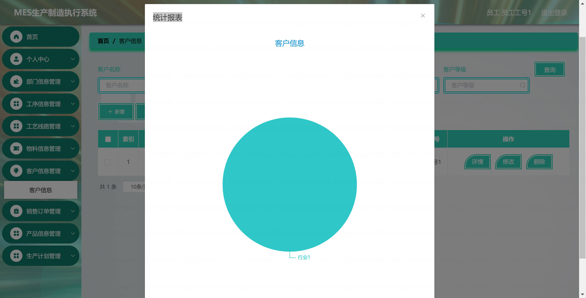

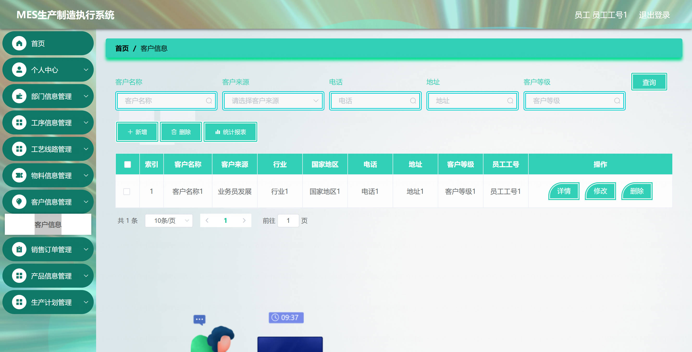

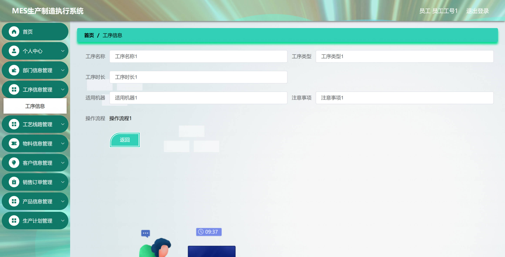

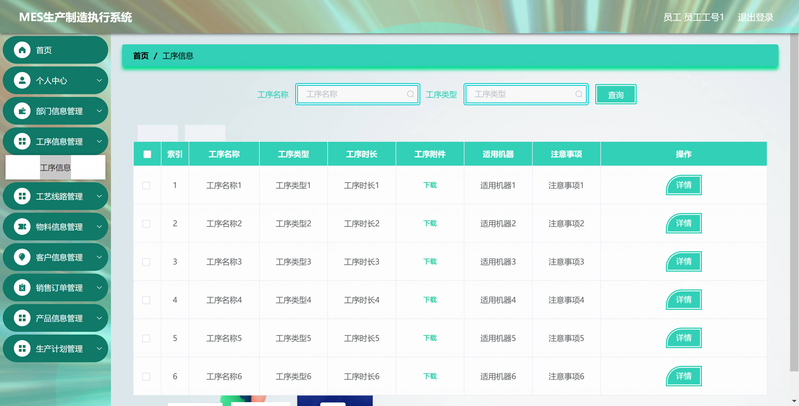

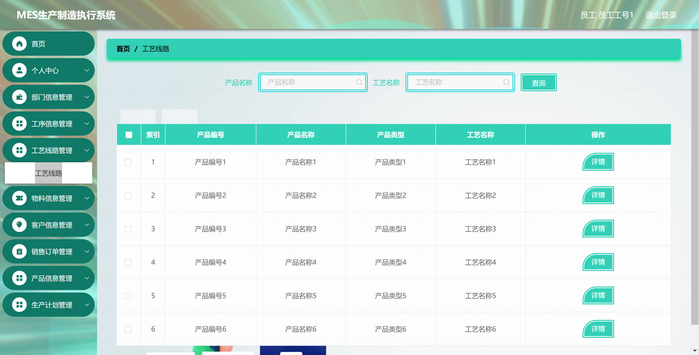

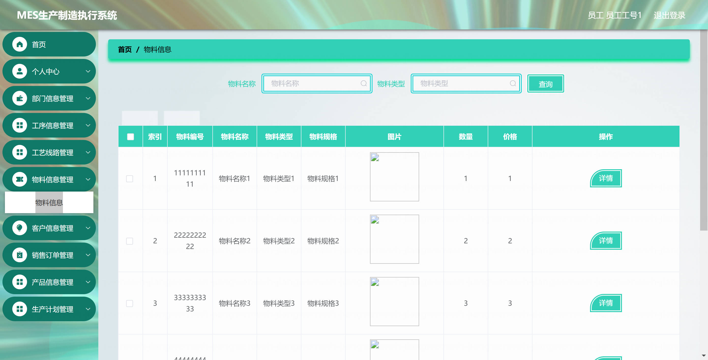

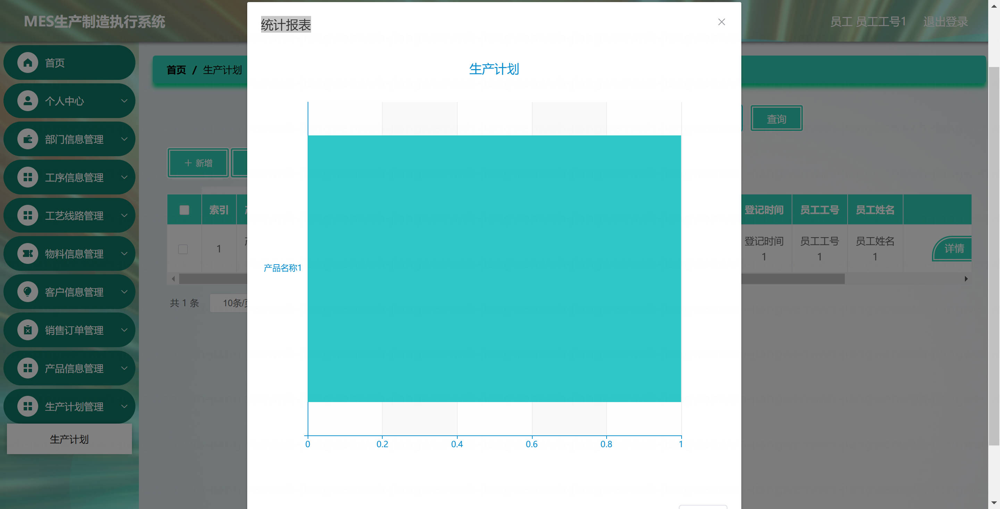

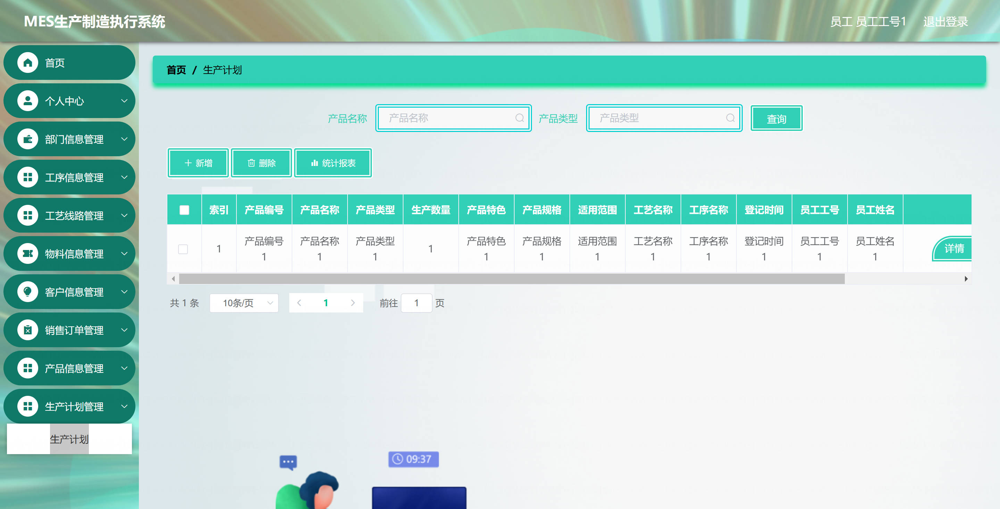

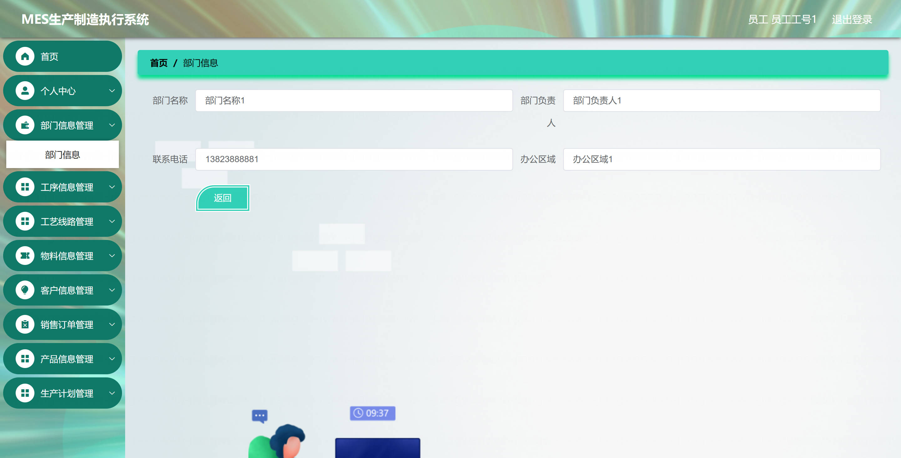
